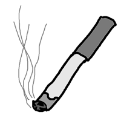

	

# bun_gothic2

Готическая тема для vscode. Вторая реализация идей [bun_gothic](https://github.com/spleekz/vscode-bun_gothic-theme).

## Идеи и концепции

bun_gothic2 — самостоятельная, независимо существующая готическая тема, наследующая и реализующая все идеи и концепции от bun_gothic.

## Особенности реализации

- Отсутствует подсветка синтаксиса
- Оформление предупреждений идентично оформлению ошибок
- Отсутствуют декорации систем контроля версий
- Отсутствуют индикаторы ошибок за полосой прокрутки
- Отсутствуют иконки подсказок
- Отсутствует цветовая поддержка миникарты
- Отсутствует цветовая поддержка редактора изменений
- Отсутствует цветовая поддержка редактора слияния
- Отсутствует подсветка направляющих отступа
- Отсутствует подсветка парных скобок
- Отсутствует подсветка совпадений в тексте

В файл `./recommended-settings.json` помещены рекомендуемые настройки, не касающиеся цветового оформления.
